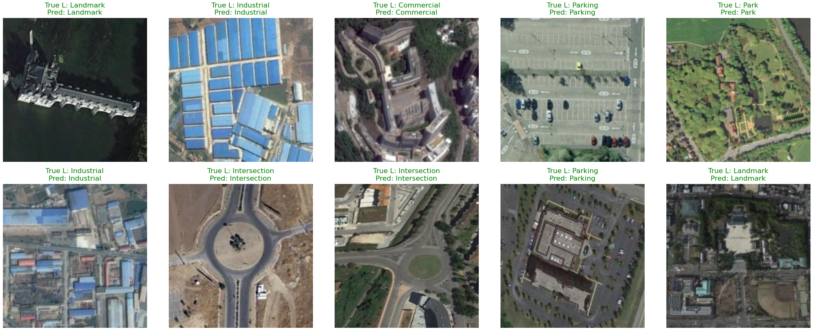
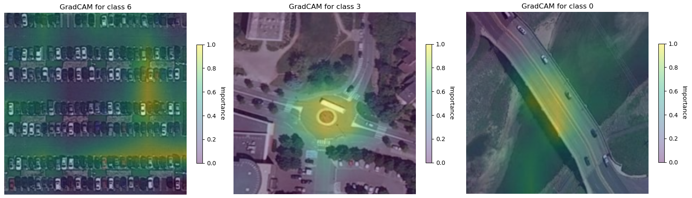
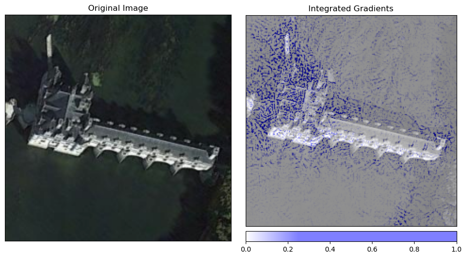
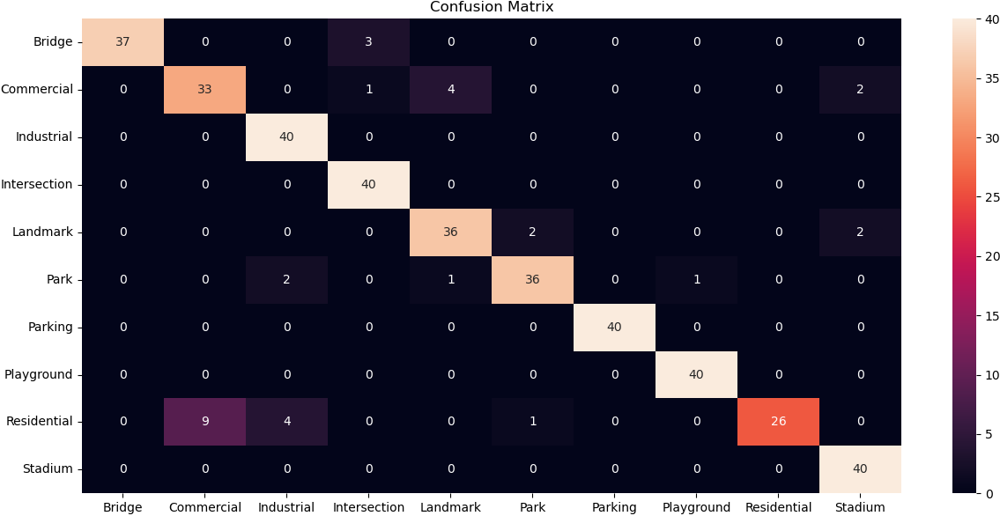
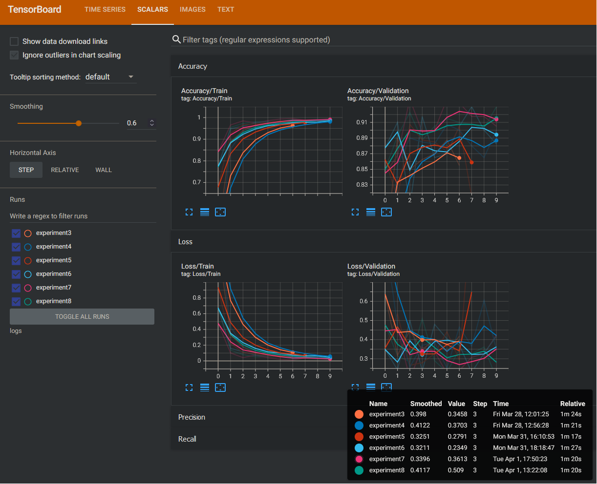
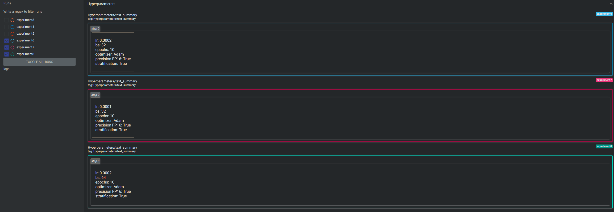

 # 🛰️ Aerial Scene Image Classifier 🌎

This project fine-tunes a **deep learning** model, specifically a **ConvNext** (tiny version) using PyTorch to classify aerial images scenes into 10 different categories. It is designed to be modular, efficient and easy to use, especially for those who work with Jupyter Notebooks. Offers the possibility to change the model easily using `timm` library and adjust, track and monitor hyperparameters using `TensorBoard.`

The classification is done using the following 10 classes:
**Bridge, Commercial, Industrial, Intersection, Landmark, Park, Parking, Playground, Residential** and **Stadium**

The model is fine-tuned using a RTX 2080 SUPER for 10 epochs, and it takes around 4min and 30secs. The idea is not to train the best possible model, but to show how is it done. It is always possible to scale it up!

Main metrics results:

 - Accuracy on the validation: 94% // Accuracy on the test: 93%
 - Precision and recall on the test set > 0.91
  
---

## ✨ **Highlight results**

### **Visual prediction of the model** 📸

> *Correct classification of sample images from test dataset"*
<br>
<br>


> *GradCAM showing relevant areas for true classes*
<br>
<br>


> *Feature attribution extraction using IntegratedGradients*


### **Confusion Matrix (Test dataset)** 📊

> *Use of scikit-learn confusion matrix function to generate a confusion matrix.* 
<br>
<br>

### **Metrics and hyperparameters monitoring using TensorBoard** 🔱


> *Experiment tracking using Tensorboard*
<br>
<br>


> *Hyperparameters log using Tensorboard*

---

## 📖 **Project Walkthrough **


In this project, we will take you step-by-step through the process of creating this classifier using PyTorch, integrate TensorBoard and analize using Captum. Below is a summary of the key steps:

1. **Define custom datasets and dataloaders with PyTorch**:  

  - *Preprocessing images to normalize and create batches of data.*  

2. **Visualization of initial data with their true labels**:  

  - *Plotting images with their labels to understand the dataset.*  

3. **Exploratory Data Analysis (EDA)**:  

  - *Check the distribution of classes in the dataset.*  

4. **Configure TensorBoard for visualization of training metrics**:  

  - *Monitor loss,  accuracy, precision and recall in real time using TensorBoard. Save the logs for visualization at any moment.*  

5. **Training and validation cycle**:  

  - *Use PyTorch to perform transfer learning of our model*.  

6. **Model inference**:  

  - *Visualizing predictions on a subset of the dataset.*  

7. **Evaluation metrics (confusion matrix)**:  

  - *Evaluate the performance of the model on the test dataset.*
8. **Model interpretation using Captum**:  

  - *Obtain visual activation maps with LayerGradCam and check where the model is focused.*
  - *Obtain an IntegratedGradients activation map using Captum and displaying it in a image, to see the contribution of each pixel.*

---
## 📊 Dataset
This project uses the dataset of [Aerial Images of Cities](https://www.kaggle.com/datasets/yessicatuteja/skycity-the-city-landscape-dataset) from Kaggle.

It is a curated dataset, bringing together urban landscapes from the publicly available AID and NWPU-Resisc45 datasets. Featuring 10 distinct city categories with 800 images each, all at a resolution of 256x256 pixels.

Download it from the above link and extract in the root  folder to work with the project (you can call it `dataset` for instance)

---


## 📂 **Project Structure**
The project is organized in a modular way imported in the main Jupyter Notebook to improve code readability and maintainability.
```markdown
Aerial-Scene-Classifier/
├── assets/              # Images for the README file
├── src/                 # Modular code used in the project
│   ├── __init__.py      # Init file
│   ├── dataloaders.py  
│   ├── dataset.py
│   ├── inference.py
│   ├── training.py
│   └── visualization.py
├── test_images_GradCAM  # Images used in the main file as samples
├── README.md            # Documentation of the project
└── requirements.txt     # Dependencies
```

## ✨ **Main features of the project**
- **Clear modularization**: The project is divided into logical sections for ease of use and understanding.
- **Easy training and real-time logging**: Configuraciones predefinidas para entrenar el modelo en nuevos datasets que sigan la misma estructuración de carpetas que el dataset original. Además es posible hacer el seguimiento en tiempo real del entrenamiento con TensorBoard
- **Great classification accuracy( 95%+)**: The model is able to classify the 10 scene with great accuracy.
- **Simple execution and results visualization**: The project can be followed step-by-step using the main jupyter notebook.

---

## 🛠️ **Libs, Frameworks and Technologies **
- **Python**: Main programming language.  

- **Jupyter Notebooks**: For workflow organization.  

- **PyTorch**: Framework for training the deep learning model. 

- **TensorBoard**: Tracking of experiments and metrics

- **OpenCV / PIL**: For image processing, manipulation.  

- **Numpy/PyTorch**: Data management and numerical calculations.

- **Captum**: Model interpreation.

- **Matplotlib/Seaborn**: Results visualization.

- **Scikit-learn, timm, tqdm**: Support libraries


---

## 📖 **How to follow the project Walktrough**

### **1. Clone the repository**
Clone the project in your local machine:
```bash
git clone https://github.com/tu-usuario/City-Scene-Classifier.git
```
### **2. Download the dataset**
The dataset required for this project is hosted in Kaggle. Follow these steps to download it:

1. Visit the dataset page on Kaggle: [Aerial Images of Cities](https://www.kaggle.com/datasets/yessicatuteja/skycity-the-city-landscape-dataset)  

2. Download the `.zip` file of the dataset.  

3. Extract the contents into the dataset/ folder of the project. The structure should look like this:

City-Scene-Classifier/  

```markdown
├── dataset/.  
|
│ ├─── Bridges/     # Images of bridges  
|
│ ├─── Commercial/  # Images of commercial zone.  
|
│ ├─── Industrial/ 	# Images of industrial zone.
...
```
  

**Note:** If you decide to place the data in a different folder name than `dataset`, be sure to update the path to the data in the main file of your Jupyter Notebook **(01_city_image_classifier_main.ipynb)**.

### **3. Install dependencies**
Make sure you have a virtual environment set up (optional, but recommended). Then install the required dependencies:
```bash
pip install -r requirements.txt
```
### **4. Follow the main Jupyter for an easy step-by-step explanation**
**01_city_image_classifier_main.ipynb** is the main Jupyter Notebook of the project. Inside there is an easy step-by-step guidance to reproduce the project, train the model, use different models, change hyperparameters and so.  

### **5. During training and experimentation, use TensorBoard local webapp**
When the training is happening:
1. Open a new terminal in your IDE
2. Set the folder to the project folder
3. Execute the following code: `tensorboard --logdir=logs`
4. The terminal will create a local server and give you a link address like: `http://localhost:<your_port>/`
5. Open the link and you will see the GUI of TensorBoard where you can follow your metrics, prints and others.

You can always execute step 3 to see your results again at any moment.


## 🌟 **Contact**

-   **Email**: rebound-buddy-size@duck.com
-  **GitHub**: https://github.com/eduardo-lezama
